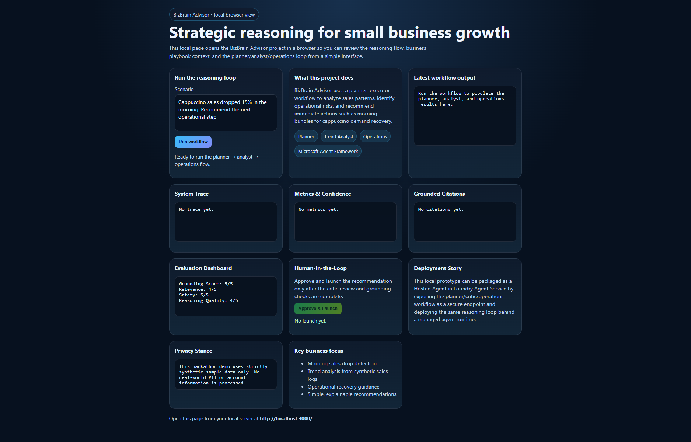
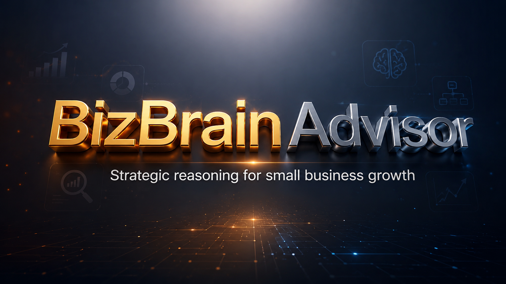
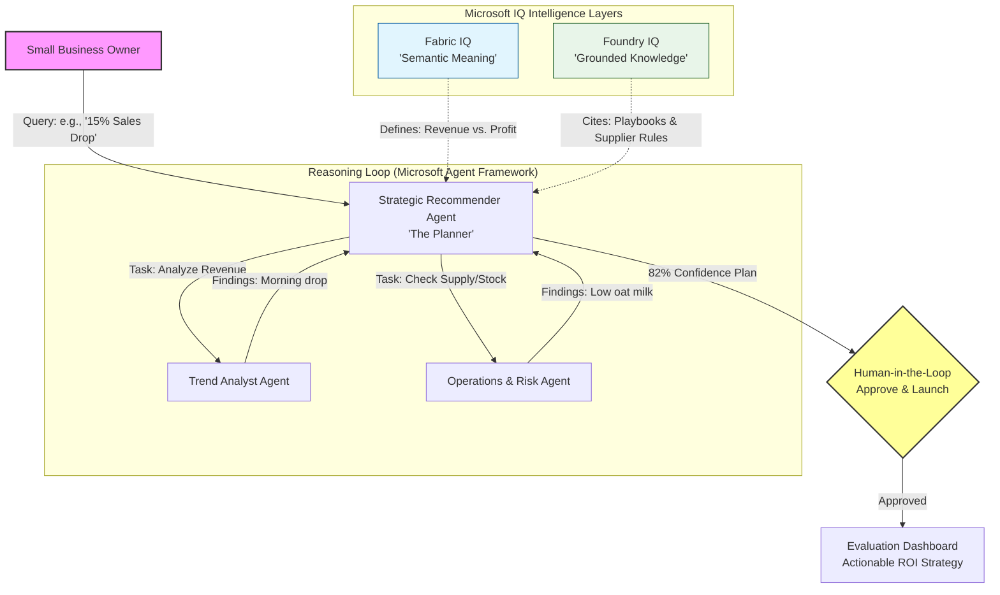

# 🧠 BizBrain Advisor: Strategic Reasoning Agent for Small Business

## 🎬 2:25-Minute Demo

## 📌 Project Overview

BizBrain Advisor is a sophisticated multi-agent reasoning system designed to empower small business owners.

While many owners have access to raw business data, they often lack the analytical expertise needed to translate that data into actionable growth strategies.

BizBrain fills this gap by decomposing complex business metrics into clear, quantified, and ROI-focused recommendations.

This project was developed for the **Agents League Hackathon (Battle #2: Reasoning Agents)**.

---

## 🎯 Why BizBrain Advisor Matters

Small businesses generate valuable operational data every day, but many owners lack the time and expertise to convert that information into strategic decisions.

BizBrain Advisor acts as an AI business analyst by:

- 📉 Detecting hidden revenue declines before they become major losses.
- 📦 Identifying operational risks such as inventory shortages.
- 💰 Estimating the ROI of recommended interventions.
- 🧠 Providing transparent reasoning with citations and human approval.

The result is a practical AI advisor that transforms raw business signals into measurable business actions.

---

## 💡 The Solution

BizBrain Advisor utilizes a **Planner–Executor reasoning pattern** to coordinate a team of specialized AI agents.

The system identifies hidden trends in revenue, synthesizes findings into grounded recommendations, and quantifies potential business impact with estimated ROI.

---

### 🏗️ Multi-Agent Architecture & Responsibilities

---

The system orchestrates four specialized agents using the Microsoft Agent Framework:

* **Trend Analyst Agent**

  * Identifies revenue shifts and anomalies (e.g., detecting a 15% drop in morning cappuccino sales)

* **Operations & Risk Agent**

  * Monitors operational metrics such as oat milk inventory falling below reorder points

* **Critic & Verifier Agent**

  * Reviews proposed actions against inventory safety rules and business constraints before final approval
  
* **Strategic Recommender Agent**

  * Synthesizes outputs from all sub-agents into an Executive Summary with prioritized, cited actions

---

## 🛠️ Microsoft IQ Integration (Core Requirement)

This project integrates Microsoft IQ intelligence layers to ground reasoning in real organizational signals:

### Foundry IQ (Agentic Retrieval)

* Retrieves context from the Business Playbook, Supplier Rules, and Synthetic Metric Definitions
* Ensures every recommendation is backed by citations

### Fabric IQ (Semantic Foundation)

* Provides the underlying ontology that allows agents to reason over business meaning rather than raw data

---

## 📊 Reasoning Loop & Observability

The local browser interface (`http://localhost:3000`) provides visibility into the agent's multi-step reasoning:

* **System Trace**

  * Shows the Planner creating tasks and the Critic validating final recommendations

* **Evaluation Dashboard**

  * Displays quality metrics including:

    * Grounding Score: 5/5
    * Reasoning Quality: 4/5

* **Human-in-the-Loop**

  * Includes an **Approve & Launch** control before any recommendation reaches production

---

## 🚀 Hosted Agent Story

Although this prototype runs locally, it is designed for enterprise-scale deployment.

The workflow can be packaged as a Hosted Agent in Foundry Agent Service, enabling:

* Session persistence
* Instrumentation and monitoring
* Secure managed scaling

---

## 🔒 Data Privacy & Synthetic Data

This project uses strictly synthetic sample data.

* No real-world PII

  * All identifiers are fabricated (e.g., EMP-001, L-1001)

* Synthetic logs

  * Sales and inventory records are generated specifically for this demo

* Local secrets

  * API keys are stored in `.env` files and excluded from source control

---
## 🛠️ Getting Started

### 1. Prerequisites
* Python 3.10+: Ensure you have a modern Python environment installed.
* Azure Subscription: Required to access Microsoft Foundry.
* Microsoft Foundry Project: You must have a project endpoint and a deployed model (e.g., Phi-4-reasoning).

### 2. Installation
* First, clone the repository and navigate to the project folder:
    * git clone https://github.com/ArdiaNova/bizbrain-advisor.git
    * cd bizbrain-advisor

### 3. Create and Activate a Virtual Environment
This ensures your dependencies do not conflict with other projects.
    * python -m venv .venv

#### Windows:
.venv\Scripts\activate

#### macOS/Linux:
source .venv/bin/activate

### 4. Install Dependencies
Install the Microsoft Agent Framework and other required libraries:
    * pip install -r requirements.txt

### 5. Configure Your Environment
    * Create a .env file in the root directory. 
        * **Note: Never commit this file to GitHub.**
    
    * AZURE_AI_PROJECT_ENDPOINT=your-project-endpoint-here
    * AZURE_AI_MODEL_DEPLOYMENT=Phi-4-reasoning
    * AZURE_AI_PROJECT_KEY=your-key-here

### 6. Run the Application
Launch the advisor and browser-based reasoning interface:
    * python run_model.py

#### 🛠️ Tech Stack & Data Sources
*   **Orchestration:** Microsoft Agent Framework
*   **Intelligence Layers:** Foundry IQ (Grounding) and Fabric IQ (Semantics)
*   **AI Assistance:** Developed using **GitHub Copilot** in VS Code
*   **Grounding Data (Synthetic):** 
    *   `business_playbook.md` (Strategic guidance)
    *   `inventory_rules.md` (Operational constraints)
    *   `sales_logs.md` (Synthetic revenue signals)

---

#### ⚠️ Important: Strategic Roadmap & Deployment
While this prototype currently runs in a local environment for the hackathon demo, it is architected for a **Hosted Agent Story**
*   **Production Path:** The Planner–Executor loop is designed to be containerized and deployed as a **Hosted Agent in Foundry Agent Service**
*   **Managed Identity:** Moving to a hosted environment allows for secure managed scaling and session persistence without baking secrets into the app code
*   **Proactive Intelligence:** Our vision includes integrating **Work IQ** to adapt these business recommendations around an owner's specific schedule and focus windows 
